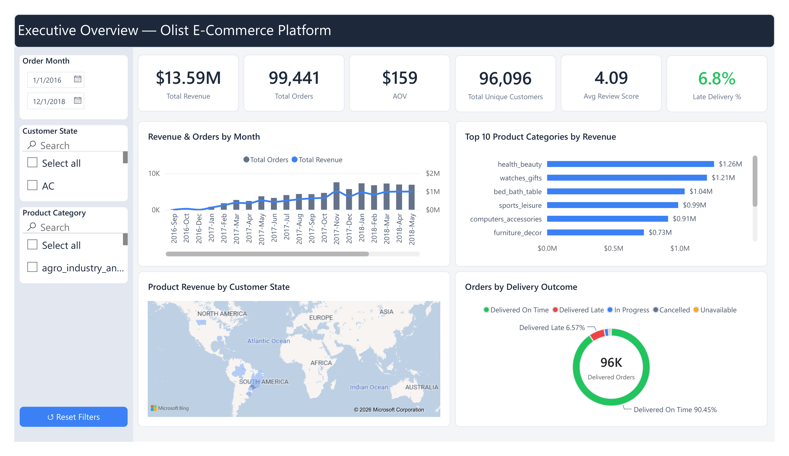
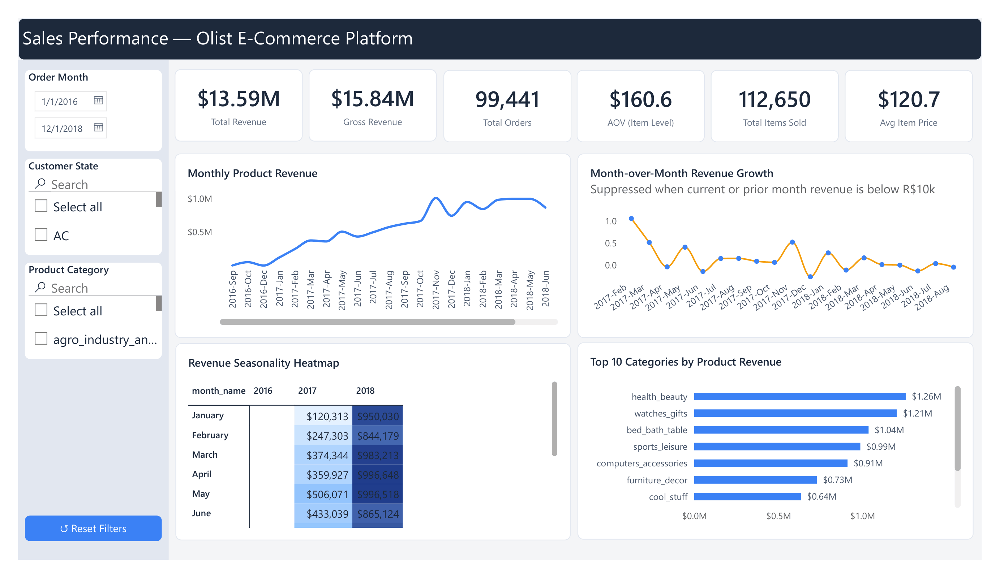
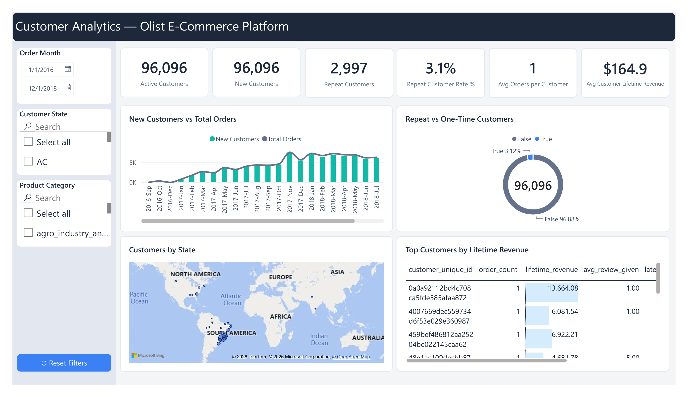
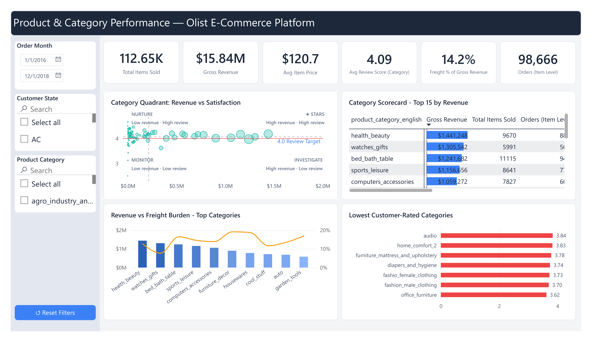
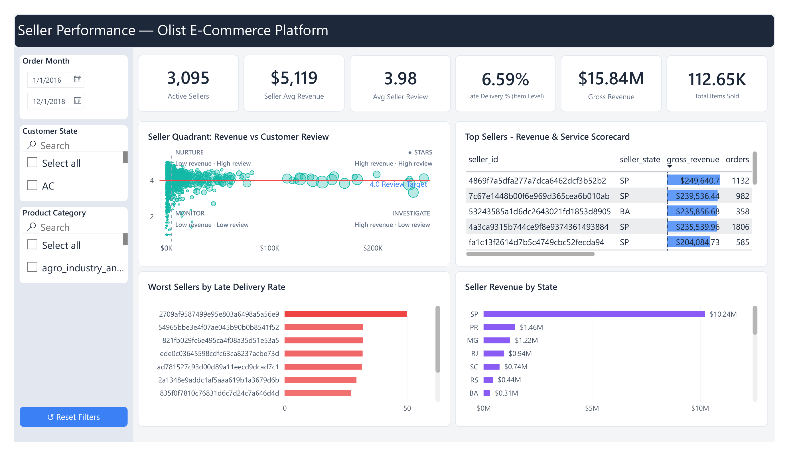
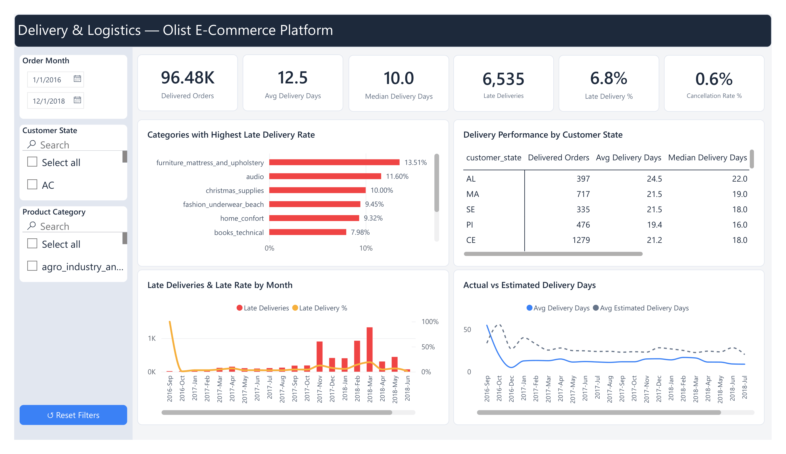
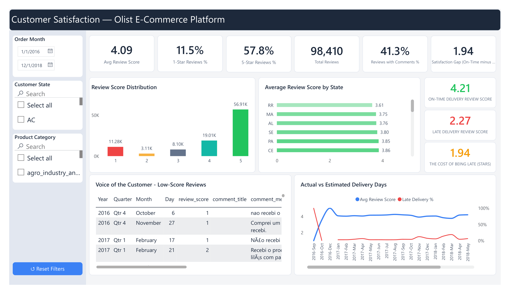

# Olist E-Commerce Analytics

An end-to-end analytics engineering project that transforms the Olist Brazilian E-Commerce dataset from raw CSV files into a tested PostgreSQL analytics warehouse using **dbt Core**.

```text
CSV files → PostgreSQL raw layer → dbt staging → dbt intermediate → dbt marts → Power BI
```

The focus of this project is the transformation workflow: ingest source data, assess quality, build a layered warehouse in dbt, test the analytical outputs, and consume the curated marts in Power BI.

---

## Dashboard preview

The Power BI report connects to the curated dbt marts in PostgreSQL and includes executive, sales, customer, product, seller, delivery, and customer-satisfaction analysis.

### Executive overview



### Sales performance



### Customer analytics



### Product and category performance



### Seller performance



### Delivery and logistics



### Customer satisfaction



The interactive Power BI report is available at [`powerbi/olist.pbix`](powerbi/olist.pbix). A static export is available at [`powerbi/olist dashboard.pdf`](powerbi/olist%20dashboard.pdf).

---

## Business objective

The Olist dataset represents a Brazilian e-commerce marketplace. It contains historical customers, orders, order items, payments, reviews, products, sellers, geolocation, and product-category translation data.

The project creates a reusable analytical layer that supports questions such as:

- How much product revenue was generated and how did it change over time?
- Which customer states, product categories, and sellers drive sales?
- Which sellers have high revenue but weak delivery or review performance?
- Where are late deliveries concentrated?
- Does late delivery affect customer satisfaction?
- Which payment methods and installment patterns are most common?
- Are customers returning after their first purchase?

---

## Architecture

```text
Client-provided CSV files
    ↓
PostgreSQL raw tables
    ↓
dbt staging models
    ↓
dbt intermediate models
    ↓
dbt marts models
    ↓
Power BI semantic model and dashboards
```

The warehouse has four PostgreSQL schemas:

| Schema | Purpose |
|---|---|
| `raw` | Client CSVs loaded as received; no business logic |
| `staging` | dbt standardized, typed, source-level models |
| `intermediate` | dbt grain resolution, aggregation, and reusable pre-join logic |
| `marts` | dbt dimensions, facts, and business-facing marts for Power BI |

---

## Source data

The client-style source files are located in `client_data/`.

| CSV file | PostgreSQL table | Description |
|---|---|---|
| `olist_customers_dataset.csv` | `raw.customers` | Customer/order identity and customer location |
| `olist_geolocation_dataset.csv` | `raw.geolocation` | Geographic coordinates by zip prefix |
| `olist_orders_dataset.csv` | `raw.orders` | Order status and lifecycle timestamps |
| `olist_order_items_dataset.csv` | `raw.order_items` | Products, sellers, price, and freight at item grain |
| `olist_order_payments_dataset.csv` | `raw.order_payments` | Payment method, installments, and payment value |
| `olist_order_reviews_dataset.csv` | `raw.order_reviews` | Review score, comments, and response timing |
| `olist_products_dataset.csv` | `raw.products` | Product category and physical attributes |
| `olist_sellers_dataset.csv` | `raw.sellers` | Seller identity and location |
| `product_category_name_translation.csv` | `raw.category_translation` | Portuguese-to-English category mapping |

---

## Why dbt

The source datasets are not at the same grain.

| Dataset | Grain |
|---|---|
| Orders | One row per `order_id` |
| Order items | One row per `(order_id, order_item_id)` |
| Payments | One row per `(order_id, payment_sequential)` |
| Reviews | One row per `review_id` |
| Geolocation | Multiple rows per zip prefix |

Joining these raw tables directly would create fan-out duplication. For example, an order with three items and two payment records would create six rows in a naïve join, inflating amounts and counts.

The dbt intermediate layer resolves this before the fact tables are built:

```text
Order items  → int_order_items_agg     → one row per order
Payments     → int_order_payments_agg  → one row per order
Reviews      → int_order_reviews_agg   → one row per order
Geolocation  → int_geolocation_by_zip  → one row per zip prefix
```

This protects revenue, payment totals, order counts, and review metrics from duplication.

---

## Setup

### Prerequisites

- PostgreSQL and `psql`
- Python 3.10+
- dbt Core with the PostgreSQL adapter
- Power BI Desktop, if you want to open the dashboard

Install dbt:

```bash
pip install dbt-postgres
```

Verify the installation:

```bash
dbt --version
```

### Create the database

Open PostgreSQL:

```bash
psql -U postgres -d postgres
```

Create and connect to the project database:

```sql
CREATE DATABASE olist_analytics;
\c olist_analytics
```

Run the schema/table DDL at the beginning of [`sql/olist.sql`](sql/olist.sql). It creates `raw`, `staging`, `intermediate`, `marts`, and the nine raw source tables.

---

## Ingest the CSV files

Connect to PostgreSQL from the repository root:

```bash
psql -U postgres -d olist_analytics
```

Load the source data into the `raw` schema:

```sql
\copy raw.customers
FROM 'client_data/olist_customers_dataset.csv'
WITH (FORMAT csv, HEADER true);

\copy raw.geolocation
FROM 'client_data/olist_geolocation_dataset.csv'
WITH (FORMAT csv, HEADER true);

\copy raw.order_items
FROM 'client_data/olist_order_items_dataset.csv'
WITH (FORMAT csv, HEADER true);

\copy raw.order_payments
FROM 'client_data/olist_order_payments_dataset.csv'
WITH (FORMAT csv, HEADER true);

\copy raw.order_reviews
FROM 'client_data/olist_order_reviews_dataset.csv'
WITH (FORMAT csv, HEADER true, ENCODING 'LATIN1');

\copy raw.orders
FROM 'client_data/olist_orders_dataset.csv'
WITH (FORMAT csv, HEADER true);

\copy raw.products
FROM 'client_data/olist_products_dataset.csv'
WITH (FORMAT csv, HEADER true);

\copy raw.sellers
FROM 'client_data/olist_sellers_dataset.csv'
WITH (FORMAT csv, HEADER true);

\copy raw.category_translation
FROM 'client_data/product_category_name_translation.csv'
WITH (FORMAT csv, HEADER true);
```

The review file is loaded with `ENCODING 'LATIN1'` because its free-text review content produces an encoding error under the default local Windows import encoding.

Validate that the loaded counts match the expected source totals:

| Raw table | Expected rows |
|---|---:|
| `raw.geolocation` | 1,000,163 |
| `raw.order_items` | 112,650 |
| `raw.order_payments` | 103,886 |
| `raw.orders` | 99,441 |
| `raw.customers` | 99,441 |
| `raw.order_reviews` | 99,224 |
| `raw.products` | 32,951 |
| `raw.sellers` | 3,095 |
| `raw.category_translation` | 71 |

---

## Raw data assessment

[`sql/olist.sql`](sql/olist.sql) contains:

- PostgreSQL schema and raw-table creation statements
- Raw ingestion row-count verification query
- Duplicate and primary-key checks
- Null checks on critical keys and values
- Foreign-key/orphan checks
- Price, freight, payment, review-score, and coordinate validity checks
- Order status and timestamp-logic checks
- Payment-to-item reconciliation checks
- Customer identity/repeat-purchase checks
- Geolocation grain and state-consistency checks
- Post-build reconciliation queries against the marts

The detailed outcomes and their implementation decisions are documented in [`sql/data_assessment_findings.md`](sql/data_assessment_findings.md).

---

## Configure dbt

The dbt project is located at `dbt/olist_analytics`.

```bash
cd dbt/olist_analytics
```

Create a local `profiles.yml` file outside the repository.

Windows:

```text
C:\Users\<your-user>\.dbt\profiles.yml
```

macOS/Linux:

```text
~/.dbt/profiles.yml
```

Use the dbt profile name configured in `dbt_project.yml`. The PostgreSQL connection should follow this pattern:

```yaml
olist_analytics:
  target: dev
  outputs:
    dev:
      type: postgres
      host: localhost
      user: postgres
      password: "YOUR_POSTGRES_PASSWORD"
      port: 5432
      dbname: olist_analytics
      schema: public
      threads: 4
```

Do not commit passwords or `profiles.yml` to GitHub.

Confirm the connection:

```bash
dbt debug
```

---

## Run dbt

Build the transformations and execute tests:

```bash
dbt build
```

Useful commands:

```bash
# Run models only
dbt run

# Execute tests only
dbt test

# Build the orders fact and all downstream dependencies
dbt build --select fct_orders+

# Build marts models
dbt build --select marts

# Generate dbt model documentation and lineage
dbt docs generate
dbt docs serve
```

The certified project build produced:

```text
24 models
70 dbt tests
68 PASS
2 WARN
0 ERROR
```

The two warnings are documented baseline conditions:

| Test | Baseline | Reason |
|---|---:|---|
| Payment reconciliation | 246 delivered orders | Payment/item gap exceeds R$1; retained and exposed for audit |
| Delivered orders with missing delivery date | 8 orders | Source delivery timestamp is missing; delivery metrics remain NULL |

---

## dbt transformations

### Staging

The models in `dbt/olist_analytics/models/staging/` standardize each source table independently.

Key transformations include:

- Casting IDs, timestamps, quantities, price, freight, and zip prefixes
- Cleaning text values with `TRIM`, `LOWER`, and `UPPER`
- Renaming source fields to consistent analytics names
- Correcting source spelling errors such as `product_name_lenght`
- Creating order-item `line_total`
- Filtering invalid geolocation coordinates
- Deduplicating review IDs and retaining the latest record
- Deriving review comment and response-time fields
- Standardizing product category translations and adding two missing mappings

The staging `sources.yml` file declares the raw PostgreSQL tables. The staging `schema.yml` file defines source/model tests including `not_null`, `unique`, and accepted values.

### Intermediate

The models in `dbt/olist_analytics/models/intermediate/` resolve grain and create reusable pre-join datasets.

| Model | Output grain | Main output |
|---|---|---|
| `int_geolocation_by_zip` | One row per zip prefix | Mean coordinates and modal city/state |
| `int_order_items_agg` | One row per order | Product revenue, freight revenue, items, sellers, products |
| `int_order_payments_agg` | One row per order | Total payment, payment type, installments, payment flags |
| `int_order_reviews_agg` | One row per order | Average review, comment flag, review count, review time |

### Marts

The models in `dbt/olist_analytics/models/marts/` build the BI-ready warehouse layer.

Dimensions:

```text
dim_date
dim_customers
dim_products
dim_sellers
```

Facts:

```text
fct_orders
fct_order_items
fct_reviews
```

Business marts:

```text
mart_customer_metrics
mart_delivery_performance
mart_sales
mart_seller_performance
```

`fct_orders` contains reusable order-level business logic used by the report:

```text
Product revenue and freight revenue
Order value and freight percentage
Payment totals, payment type, and installments
Payment-to-item reconciliation gap
Review summary and review-comment flag
Delivered, cancelled, and in-progress status flags
Delivery days and estimated delivery days
Approval hours and days to ship
Late-delivery flag and delay days versus estimate
```

The mart `schema.yml` files define model tests, relationship tests, uniqueness expectations, and final analytical-model constraints.

---

## Data-quality decisions

| Area | Finding | Treatment |
|---|---|---|
| Duplicate reviews | Duplicate `review_id` values in raw reviews | Deduplicated in staging; latest record retained |
| Multiple reviews per order | Some orders have more than one review | Aggregated to a safe order-level review summary |
| Product master-data gaps | Products without category data | Retained as `uncategorized` in the product dimension |
| Category translations | Two translation gaps in source data | Added as explicit mappings in staging |
| Orders without items | Mostly unavailable/cancelled orders without item records | Retained; item revenue is zero and `has_items` is false |
| Payment/item differences | Some orders have a material reconciliation gap | Retained and exposed through `payment_item_gap` |
| Missing delivery dates | Eight delivered orders lack a delivered timestamp | Retained; delivery metrics are NULL |
| Geolocation duplicates | Many source records per zip prefix | Collapsed to one location per zip prefix |
| Customer identity | `customer_id` is order-level; people can repeat | Customer metrics use `customer_unique_id` |

---

## Post-build validation

Run the marts reconciliation queries at the end of [`sql/olist.sql`](sql/olist.sql) after `dbt build` completes.

Product revenue must reconcile across fact grains:

```sql
SELECT
    (SELECT ROUND(SUM(product_revenue), 2) FROM marts.fct_orders)
        AS order_grain_revenue,
    (SELECT ROUND(SUM(price), 2) FROM marts.fct_order_items)
        AS item_grain_revenue;
```

Expected result:

```text
order_grain_revenue: R$13,591,643.70
item_grain_revenue:  R$13,591,643.70
```

The SQL script also checks the revenue share of the `uncategorized` category and the payment/item gap as a percentage of affected delivered-order value.

---

## Power BI consumption

Power BI should connect to the PostgreSQL `marts` schema only.

Recommended Power BI tables:

```text
marts.dim_date
marts.dim_customers
marts.dim_products
marts.dim_sellers
marts.fct_orders
marts.fct_order_items
marts.fct_reviews
marts.mart_customer_metrics
marts.mart_sales
marts.mart_seller_performance
marts.mart_delivery_performance
```

The transformation logic stays in PostgreSQL and dbt. Power BI is used for report relationships, DAX measures, slicers, charts, tables, tooltips, bookmarks, navigation, and business storytelling.

---

## Key results

| Metric | Value |
|---|---:|
| Product revenue | R$13,591,643.70 |
| Orders | 99,441 |
| Unique customers | 96,096 |
| Repeat customers | 2,997 |
| Repeat customer rate | 3.12% |
| Sellers | 3,095 |
| Items sold | 112,650 |
| Clean unique reviews | 98,410 |
| Delivered orders | 96,478 |
| Cancelled orders | 625 |

---

## Known limitations

- The data is historical, not a live production feed.
- Order purchase timestamps run from September 2016 to October 2018. Opening and closing months may be incomplete, so month-over-month percentages need careful interpretation.
- The dataset supports revenue analysis but does not include cost of goods sold, commissions, advertising spend, or operational costs; it does not support profit analysis.
- A small number of delivery dates and product attributes are missing. These records remain in the warehouse and are handled through documented data-quality rules.

---

## Author

**Asaad Areeb**  
Data Analyst / BI Developer